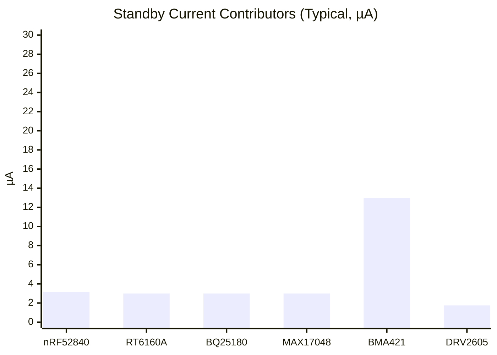

# InkTime Hardware Implementation

## Executive summary

This repository documents the **hardware implementation** of the InkTime device as captured in the provided schematic (MCU, power, sensors, haptics, USB, RF, and e‑paper interface circuitry). citeturn36view0

At a high level, the design uses an **nRF52840 SoC** as the main controller, powered from a **single‑cell Li‑ion/LiPo battery** through a **buck‑boost 3.3 V rail**, with **USB‑C input** feeding a **charger/power‑path PMIC**. The MCU communicates with the PMIC, regulator, IMU, fuel gauge, and haptic driver over a shared **I²C bus**, and drives the e‑paper connector using **SPI + GPIO** plus a dedicated **power‑gate and charge‑pump rail generator** for the panel high‑voltage rails. citeturn36view0turn3view0turn3view1

A conservative **standby (always‑on) current estimate** for the baseline configuration (MCU in System ON + RTC, regulator enabled, IMU in low‑power mode, fuel gauge in hibernate, haptic driver shut down, PMIC in battery-only mode) is **≈ 26.9 µA**, corresponding to **~155 days (100 mAh)** or **~310 days (200 mAh)** battery life (ignoring cell self‑discharge and assuming the e‑paper power domain is gated off while idle). citeturn23view0turn15view0turn16view0turn18view0turn17view0turn20view0

## System block diagram and interconnects

```mermaid
flowchart LR
  USB[USB-C Receptacle] -->|VBUS| PMIC[BQ25180 Charger + Power-Path]
  USB -->|D+/D-| ESD[USBLC6-2SC6Y ESD]
  ESD -->|USB FS| MCU[nRF52840]

  PMIC -->|VBAT| BAT[1-cell Li-ion/LiPo]
  BAT -->|VBAT| REG[RT6160A Buck-Boost -> 3V3]
  REG -->|3V3| MCU

  MCU <-->|I2C| FG[MAX17048 Fuel Gauge]
  MCU <-->|I2C| IMU[BMA421 Accelerometer]
  MCU <-->|I2C| HAPT[DRV2605 Haptic Driver]
  MCU -->|GPIO| BTN[Buttons: Up/Down/Enter]

  MCU -->|SPI + GPIO| EPDIF[E-paper Connector]
  MCU -->|PWR_EPD| EPDPOW[EPD Power Gate + Charge Pump]

  MCU -->|RF (ANT)| RFNET[RF Match]
  RFNET --> ANT[2.4 GHz Chip Antenna]

  MCU <-->|SWD| SWD[SWD Pads/Connector]
```

(Interconnects and blocks derived from the schematic.) citeturn36view0turn3view0turn3view1

### Electrical interface summary

The hardware uses four primary interconnect classes:

- **I²C (TWI)**: shared control/telemetry bus for PMIC, buck‑boost regulator, fuel gauge, IMU, and haptic driver. citeturn36view0turn3view0turn3view1  
- **SPI (SPIM)**: e‑paper interface uses SCK/MOSI/CS plus dedicated GPIOs (DC, RST, BUSY). citeturn36view0turn3view1  
- **USB 2.0 Full Speed (Device)**: D+/D− plus VBUS detect, protected by low-capacitance ESD. citeturn34view0turn21view0turn3view1  
- **RF single‑ended 2.4 GHz**: SoC ANT pin → matching network → chip antenna. citeturn33view0turn22search0turn22search16  

Recommended bus configuration choices aligned with the component set:

- **I²C clock**: **400 kHz (Fast-mode)**. The nRF52840 TWI peripheral supports 100 kHz and 400 kHz operation, and DRV2605 explicitly specifies up to 400 kHz SCL without wait states. citeturn30view0turn20view0  
- **SPI mode**: nRF52840 SPIM supports SPI modes **0–3** (CPOL/CPHA configurable). Select the mode required by the e‑paper controller on the attached display/FPC. citeturn35view1turn3view1  
- **SPI frequency**: the nRF52840 supports high‑speed SPI up to **32 MHz** (subject to signal integrity and slave constraints). citeturn35view0turn35view3  

## Bill of materials

The table below lists **major ICs/modules and key electromechanical components**. Any item not clearly available as an in‑catalog JLC assembly part is marked **“JLC Global Sourcing / LCSC”** and should be sourced via that workflow (or substituted with a footprint‑compatible equivalent after verifying electrical limits and package). citeturn39search1turn36view0

| Item | Designator(s) | MPN / Value | Qty | Purpose | Procurement (JLC preferred) | Datasheet (primary) |
|---|---|---:|---:|---|---|---|
| Main SoC | U1 | nRF52840 (aQFN73/QIAA family) | 1 | MCU + BLE radio + USB FS device | JLC Parts (C190794) citeturn4search0 | nRF52840 Product Brief (currents/features) citeturn23view0; nRF52840 Product Specification (pin mapping, SPIM/TWI/USB details) citeturn34view0turn35view1turn30view0 |
| Charger + power-path PMIC | IC? (PMIC block) | BQ25180YBGR | 1 | USB-powered Li‑ion charge management + SYS power-path + ship modes | JLC Global Sourcing / LCSC (search by MPN) citeturn39search1 | BQ25180 datasheet citeturn16view0 |
| Buck‑boost 3.3 V regulator | IC? (reg block) | RT6160AWSC | 1 | VBAT → regulated 3V3 rail (I²C configurable) | JLC Global Sourcing / LCSC (search by MPN) citeturn39search1 | RT6160A datasheet citeturn15view0 |
| Buck‑boost inductor | L7 | 470 nH (FTC252012SR47MBCA) | 1 | Energy storage for RT6160A | JLC Parts (C5832368) citeturn10search0 | JLC/LCSC listing (includes datasheet link) citeturn10search0turn10search2 |
| Fuel gauge | U3 | MAX17048G+T10 | 1 | Battery SOC/voltage reporting over I²C + alert | JLC Parts (C2682616) citeturn39search0 | MAX17048/MAX17049 datasheet citeturn17view0 |
| IMU (accelerometer) | U? (IMU block) | BMA421 | 1 | Motion sensing + interrupts (2x INT) | JLC Global Sourcing / LCSC (search by MPN) citeturn39search1 | BMA421 datasheet citeturn18view0 |
| Haptic driver | IC2 | DRV2605YZFR | 1 | Drives ERM/LRA actuator; I²C control | JLC Parts (C133542) citeturn4search3 | DRV2605 datasheet (I²C timing + currents) citeturn20view0 |
| USB ESD protection | D3 | USBLC6-2SC6Y (or footprint‑equivalent USBLC6-2SC6) | 1 | Protects D+/D− and VBUS; low line capacitance | JLC Parts (USBLC6‑2SC6, C7519) citeturn39search2 | USBLC6‑2SC6Y datasheet citeturn21view0 |
| USB‑C receptacle | J4 | KH‑TYPE‑C‑16P | 1 | USB‑C connection for VBUS and USB data | JLC Parts (C709357) citeturn5search1 | JLC part listing (datasheet link) citeturn5search1 |
| E‑paper FPC connector | J1 | 503480‑2400 (24‑pin) | 1 | E‑paper display interconnect | JLC Global Sourcing / LCSC (C2934918 listing) citeturn6search3 | LCSC listing (mechanical/datasheet link) citeturn6search3 |
| E‑paper power gate (P‑MOSFET) | Q1 | DMG2305UX‑7 | 1 | Switches EPD_3V3 power domain | JLC Parts (C425246) citeturn4search5 | JLC listing (datasheet link) citeturn4search5 |
| E‑paper analog switch / MOSFET | Q3 | SI1308EDL‑T1‑GE3 | 1 | Drives panel high‑voltage switching nodes (GDR/RESE path) | LCSC (C469327) citeturn7search17 | SI1308EDL datasheet citeturn7search10 |
| RF antenna | ANT1 | 2450AT18B100E (2.4 GHz chip antenna) | 1 | 2.4 GHz radiator | LCSC (C2917717) citeturn22search0 | Antenna datasheet (matching/layout guidance) citeturn22search16 |
| RF matching network | L/C near ANT/FEED | (e.g., 3.3 nH, 0.8 pF per reference values) | 1 set | Match SoC RF to antenna, tune return loss | JLC Parts (value/footprint‑based selection) citeturn39search1 | nRF52840 reference circuitry section (pin/usage context) citeturn37view2 |
| Buttons | SW_UP/SW_DN/SW_ENT | Tactile switches + resistors | 3 | User input | JLC Parts (value/footprint‑based selection) citeturn39search1turn3view1 | N/A (component-series dependent) |

Notes:
- The schematic explicitly calls out **BQ25180YBGR**, **RT6160AWSC**, **MAX17048G+T10**, **DRV2605YZFR**, **USBLC6-2SC6Y**, **KH-TYPE-C-16P**, **503480-2400**, **DMG2305UX-7**, **SI1308EDL-T1-GE3**, and an **RF chip antenna** in the 2450AT18B100 family. citeturn36view0  
- For USB ESD procurement, JLC lists **USBLC6‑2SC6**, while the schematic specifies **USBLC6‑2SC6Y**; they are footprint-compatible variants in the same family. Electrical limits must be checked for your exact variant. citeturn21view0turn39search2turn36view0  

## Hardware functionality and implementation details

### Power path, charging, and system rails

**USB‑C input and protection.** The USB‑C receptacle provides VBUS and USB data lines; the design includes a dedicated ESD protection device protecting **D+/D− and VBUS** with very low capacitance to preserve signal integrity. citeturn36view0turn3view1turn21view0  
The selected USBLC6 family is specified for **USB 2.0 ports up to 480 Mb/s** and lists typical **~2.5 pF** line capacitance and very low leakage (nA‑scale), which is appropriate for high‑speed data protection. citeturn21view0

**Charger + power-path (BQ25180).** The PMIC provides a USB‑powered single‑cell charger with a regulated system rail (SYS) and multiple ultra‑low power modes. The datasheet indicates a **regulated SYS voltage range of 4.4–4.9 V** (configurable) and **ultra‑low quiescent current modes** including **~3 µA battery-only** and **~3.2 µA ship mode** (typical feature-level statements). citeturn16view0  
This PMIC is controlled via **I²C** and can assert an **/INT** line to the MCU for events/faults (as reflected by the schematic net naming and the PMIC datasheet’s host interface concept). citeturn36view0turn16view0turn3view0

**Battery rail (VBAT).** The battery node is distributed as **VBAT** and is also fed to the fuel gauge and to the buck‑boost converter input. The schematic provides test points for VBAT and ground for characterization. citeturn36view0turn3view1

**3.3 V rail generation (RT6160A buck‑boost).** VBAT is converted to a regulated **3V3** rail by RT6160A, a single‑inductor synchronous buck‑boost with an **I²C interface up to 1 MHz**, programmable VOUT range, and low quiescent current design (single‑digit µA typical, mode-dependent). citeturn15view0turn36view0  
The design uses a dedicated power inductor (470 nH class) consistent with the regulator’s application requirements. citeturn10search0turn15view0turn3view0

Operationally:
- At light loads, RT6160A uses automatic PFM/Deep Sleep to maintain efficiency and reduce quiescent loss. citeturn15view0  
- The 3V3 rail powers the SoC and all low-voltage peripherals (IMU, fuel gauge, haptic driver logic). citeturn36view0turn3view0  

### Battery fuel gauge telemetry

The design uses **MAX17048** (ModelGauge) to estimate battery state‑of‑charge and voltage via **I²C**, and asserts an **ALRT** interrupt output for configurable thresholds. citeturn17view0turn36view0  
For always‑on operation, MAX17048 supports automatic entry into **hibernate mode (~3 µA)** while maintaining fuel gauging, and **active mode (~23 µA)** when needed. citeturn17view0turn39search0

### IMU (accelerometer) and wake signaling

The IMU is a **BMA421** 3‑axis accelerometer with **I²C/SPI digital interfaces** and **two interrupt pins**, allowing low‑power always‑on event detection without continuous MCU polling. citeturn18view0turn36view0  

Key current modes cited by the datasheet:
- Always-on/low-power operation down to **~13 µA (@ 50 Hz)**. citeturn18view0  
- Step-counting “embedded intelligence” example at **~25 µA** (application-context value). citeturn18view0  

The schematic routes **INT1** and **INT2** to two independent MCU GPIOs, enabling flexible wake/event mapping (e.g., wake-on-motion vs. tap). citeturn36view0turn3view0

### Haptic driver (DRV2605)

DRV2605 provides ERM/LRA drive with an internal library and closed-loop features, controlled over **I²C**. citeturn19view0turn36view0  
The I²C timing table specifies **fSCL up to 400 kHz** (no wait states), which aligns with using 400 kHz for the shared bus. citeturn20view0turn30view0  

Power management is implemented using the device **EN** pin:
- **Shutdown current** is specified in the **single‑digit µA** range (typ. 1.75 µA). citeturn20view0  
This is consistent with an approach where the MCU asserts a dedicated **HAPTIC_EN** GPIO only when haptics are needed. citeturn36view0turn3view1

### E‑paper connector, power gating, and charge‑pump rails

**Connector and signals.** The e‑paper interface is exposed on a 24‑pin FPC connector and includes:
- SPI signals (SCK, MOSI, CS) and control lines (DC, RST, BUSY). citeturn36view0turn3view1  
- Multiple panel electrode/drive pins labeled `EPD_Cx` (panel‑specific). citeturn36view0  

**Dedicated e‑paper power domain (EPD_3V3).** The design includes a **load switch/power gate** using a P‑channel MOSFET (DMG2305UX‑7) controlled by a MCU GPIO (`PWR_EPD`). This enables aggressive power gating of the panel domain when not actively refreshing. citeturn36view0turn4search5turn3view1  

**Charge pump / high-voltage rails.** The schematic shows a discrete inductor/diode/capacitor network generating labeled rails **PREVGH** and **PREVGL**, typical of e‑paper panel bias generation, using:
- Inductor **L5 = 68 µH**,  
- Multiple **MBR0530** Schottky diodes,  
- High‑voltage capacitors (e.g., 1 µF/50 V class). citeturn36view0turn3view1  
A dedicated MOSFET (SI1308EDL) participates in this drive/rail switching network. citeturn36view0turn7search10turn7search17  

Because e‑paper panels/controllers vary widely, the exact timing, required rail voltages, and refresh energy depend on the specific display used; the board provides the foundational rails and switching nodes called out in the schematic. citeturn36view0turn3view1  

### USB device, VBUS detect, and ESD strategy

The nRF52840 QIAA package assigns dedicated pads for:
- **VBUS** (USB 5 V input for the on-chip USB regulator),  
- **D−** and **D+**,  
- **DECUSB** (USB 3.3 V regulator decoupling). citeturn34view0  

The product specification notes that **VBUS and either VDDH or VDD are required for USB peripheral operation**, and VBUS transitions generate detection events (and can wake from System OFF). citeturn31view3  

Externally, the USBLC6 device protects the USB lines while meeting USB 2.0 signal integrity constraints via low capacitance. citeturn21view0turn36view0  

### RF output, matching, and antenna

The nRF52840 provides a dedicated **ANT** RF pin (single-ended antenna connection). citeturn33view0turn37view2  
The schematic includes an RF feed/matching section and a 2.4 GHz chip antenna footprint. citeturn36view0turn3view0  

The selected antenna family (2450AT18B100E) is specified for the 2.4 GHz band (operational frequency range around **2400–2500 MHz** with 50 Ω impedance in the antenna datasheet family), and requires careful PCB layout and matching as guided by the antenna documentation. citeturn22search0turn22search16  

## nRF52840 pin mapping

This section provides an explicit mapping of **board signals → exact nRF52840 pins** and why those pins were selected. Pin naming and ball locations are taken from the nRF52840 QIAA pin assignment table. citeturn33view0turn34view0  
Net names are taken from the schematic. citeturn36view0turn3view0turn3view1

### Pin mapping table

| Subsystem | Net / signal | nRF52840 port pin | Package ball / pad | Dir. | Rationale / design notes |
|---|---|---|---|---|---|
| I²C bus | SDA | P0.06 | L1 | I/O | Shared I²C data line to PMIC/regulator/fuel gauge/IMU/haptic; placed on standard GPIO. citeturn36view0turn33view0 |
| I²C bus | SCL | P0.07 | M2 | I/O | Shared I²C clock; nRF TWI supports 100/400 kHz; matches DRV2605 max 400 kHz. citeturn36view0turn30view0turn20view0turn33view0 |
| Fuel gauge | ALERT | P0.09 (NFC1)* | L24 | In | Interrupt from MAX17048 ALRT; uses an available GPIO that is multiplexed with NFC1. citeturn36view0turn33view0turn17view0 |
| PMIC | PMIC_INT | P0.11 | T2 | In | Dedicated PMIC interrupt line; avoids NFC pins; keeps wake sources on port 0. citeturn36view0turn33view0 |
| IMU | IMU_INT1 | P0.08 | N1 | In | Primary IMU interrupt line; BMA421 supports 2 interrupts. citeturn36view0turn33view0turn18view0 |
| IMU | IMU_INT2 | P1.08 | P2 | In | Secondary IMU interrupt (e.g., step vs. motion). citeturn36view0turn33view0turn18view0 |
| Haptics | HAPTIC_EN | P0.12 | U1 | Out | Gates DRV2605 EN for lowest-power shutdown when haptics unused. citeturn36view0turn33view0turn20view0 |
| Buttons | SW_UP | P0.13 | AD8 | In | User input GPIO; placed on port 0. citeturn36view0turn33view0turn3view1 |
| Buttons | SW_ENT | P0.14 | AC9 | In | User input GPIO; adjacent to SW_UP for simple routing. citeturn36view0turn33view0turn3view1 |
| Buttons | SW_DN | P1.02 | W24 | In | User input GPIO on port 1; preserves port 0 grouping for display control lines. citeturn33view0turn3view1 |
| E‑paper SPI | SCK | P0.02 | A12 | Out | SPI clock; P0.02 is a standard GPIO/analog pin suitable for SPIM mapping. citeturn36view0turn33view0turn35view1 |
| E‑paper SPI | MOSI | P0.03 | B13 | Out | SPI MOSI; display write-only SPI is common; SPIM supports selectable pins. citeturn36view0turn33view0turn35view1 |
| E‑paper SPI | EPD_CS | P0.05 | K2 | Out | Chip select on a nearby GPIO; SPIM can map CSN to any GPIO if needed. citeturn36view0turn33view0turn35view1 |
| E‑paper GPIO | EPD_DC | P0.15 | AD10 | Out | Data/command select; grouped with other display GPIOs (RST/BUSY). citeturn36view0turn34view0 |
| E‑paper GPIO | EPD_RST | P0.16 | AC11 | Out | Display reset; grouped with display signals. citeturn36view0turn34view0 |
| E‑paper GPIO | EPD_BUSY | P0.17 | AD12 | In | Display busy/status; grouped with display signals. citeturn36view0turn34view0 |
| E‑paper power | PWR_EPD | P1.01 | Y23 | Out | Enables the EPD_3V3 load switch to fully gate the high-draw e‑paper domain while idle. citeturn36view0turn33view0 |
| USB | D− | D− | AD4 | I/O | Dedicated USB D− pin (USBD). citeturn34view0turn21view0 |
| USB | D+ | D+ | AD6 | I/O | Dedicated USB D+ pin (USBD). citeturn34view0turn21view0 |
| USB | VBUS detect / LDO input | VBUS | AD2 | In (power sense) | Required for USBD operation and VBUS detection events. citeturn34view0turn31view3 |
| Debug | SWDIO | SWDIO | AC24 | I/O | SWD programming/debug. citeturn34view0turn36view0 |
| Debug | SWDCLK | SWDCLK | AA24 | In | SWD clock. citeturn34view0turn36view0 |
| Reset | nRESET | P0.18 / nRESET | AC13 | In | External reset capability configured on P0.18. citeturn34view0turn33view0 |
| RF | ANT | ANT | H23 | RF | Single-ended antenna port → matching → antenna. citeturn33view0turn22search0turn36view0 |
| HF crystal | XC1 / XC2 | XC1 / XC2 | B24 / A23 | Analog | External 32 MHz crystal pins for the high-frequency clock reference. citeturn33view0turn35view0 |
| LF crystal | XL1 / XL2 | P0.00 / P0.01 | D2 / F2 | Analog | 32.768 kHz crystal pins (low-frequency clock). citeturn33view0turn35view0 |

\* **Note on NFC pins used as GPIO:** P0.09 and P0.10 are multiplexed with NFC1/NFC2 (NFCT antenna pins). Using P0.09 as a GPIO for ALERT implies the NFC function is not used (NFCT antenna would otherwise connect between NFC1 and NFC2). citeturn33view0turn37view0turn37view2

## Power budget and battery-life estimates

This section provides a **standby baseline** and an example **active contributor** model. All currents below are **typical datasheet values** at nominal supply and assume the design is configured to use each component’s low‑power mode. citeturn23view0turn15view0turn16view0turn17view0turn18view0turn20view0

### Standby baseline current model

Assumed baseline state:
- nRF52840 in **System ON, full RAM retention + RTC** (wake on GPIO/RTC/interrupt). citeturn23view0turn31view3  
- RT6160A regulator enabled at light load (low quiescent current regime). citeturn15view0  
- BQ25180 in **battery-only mode** (no adapter present). citeturn16view0  
- MAX17048 in **hibernate**. citeturn17view0  
- BMA421 in **low-power mode (~13 µA @ 50 Hz)**. citeturn18view0  
- DRV2605 held in **shutdown via EN**. citeturn20view0turn36view0  
- E‑paper power domain gated off (PWR_EPD low). citeturn36view0  

| Block | Typical current used | Source |
|---|---:|---|
| nRF52840 (System ON + RTC + full RAM retention) | 3.16 µA | nRF52840 product brief citeturn23view0 |
| RT6160A buck‑boost (light‑load quiescent) | 3 µA (typical feature statement) | RT6160A datasheet citeturn15view0 |
| BQ25180 (battery‑only mode) | 3 µA | BQ25180 datasheet citeturn16view0 |
| MAX17048 (hibernate) | 3 µA | MAX17048 datasheet citeturn17view0 |
| BMA421 (low‑power mode @ 50 Hz) | 13 µA | BMA421 datasheet citeturn18view0 |
| DRV2605 (shutdown) | 1.75 µA (typical) | DRV2605 datasheet citeturn20view0 |
| **Total baseline** | **≈ 26.9 µA** | Sum of the above |

### Standby current visualization (Mermaid bar chart)



(Values used are taken from the cited datasheets/product brief above.) citeturn23view0turn15view0turn16view0turn17view0turn18view0turn20view0

### Battery life examples (100 mAh and 200 mAh)

Battery life estimate uses:

\[
\text{Life (hours)} \approx \frac{C_{\text{mAh}}}{I_{\text{avg(mA)}}}
\quad\text{with}\quad
I_{\text{avg(mA)}} = \frac{I_{\text{avg(µA)}}}{1000}
\]

Baseline standby average current: **26.9 µA** (0.0269 mA). (Derived from the table above.) citeturn23view0turn15view0turn16view0turn17view0turn18view0turn20view0

| Cell capacity | Avg current | Estimated life (hours) | Estimated life (days) |
|---:|---:|---:|---:|
| 100 mAh | 26.9 µA | ~3716 h | **~155 days** |
| 200 mAh | 26.9 µA | ~7432 h | **~310 days** |

These values **exclude**:
- cell self‑discharge,
- regulator efficiency variation with temperature/load,
- any periodic BLE, display refresh, or haptic events,
- leakage through external connectors/cabling. citeturn15view0turn16view0turn21view0  

### Example “active contributor” model: BLE advertising overhead

The nRF52840 radio current is listed as **6.40 mA at 0 dBm TX** (DC/DC @ 3 V) and **6.26 mA in RX (1 Mbps)**. citeturn23view0  

If the device performs periodic advertisements, the average current contribution is dominated by **TX/RX duty cycle**. A simple approximation:

\[
I_{\text{adv,avg}} \approx I_{\text{TX}} \cdot \frac{t_{\text{radio}}}{T_{\text{interval}}}
\]

**Worked example (assumption):** advertising interval **1 s**, total radio-on time **3 ms per interval** (3 channels + overhead).  
Then \( I_{\text{adv,avg}} \approx 6.4\text{ mA} \cdot 0.003 = 19.2\text{ µA} \). (TX current from datasheet; timing is a workload assumption.) citeturn23view0  

New average: \( 26.9 + 19.2 \approx 46.1 \) µA.

| Cell capacity | Avg current | Estimated life (days) |
|---:|---:|---:|
| 100 mAh | ~46.1 µA | ~90 days |
| 200 mAh | ~46.1 µA | ~181 days |

## Assumptions and ambiguity list

1. **Exact nRF52840 orderable variant/package.** The schematic labels the SoC generically while the pinout corresponds to the **QIAA/aQFN73** variant (USB dedicated pins, SWD ball names). The BOM assumes the commonly stocked QIAA family part used by JLC (C190794) and uses the QIAA pin assignment table for ball names. citeturn4search0turn34view0turn33view0  
2. **E‑paper panel/controller specifics are not provided.** The connector and discrete rail generation (PREVGH/PREVGL, GDR/RESE) are present, but **SPI mode, refresh timing, and refresh energy** depend on the attached panel/controller. The README treats these as panel‑dependent. citeturn36view0turn3view1  
3. **Procurement availability on JLC can change.** For components not explicitly found as a JLC in-catalog part in this research pass (e.g., BQ25180YBGR, RT6160AWSC, BMA421), procurement is marked **JLC Global Sourcing / LCSC search by MPN**, and an exact order flow should be validated before finalizing the assembly BOM. citeturn39search1turn36view0  
4. **USB ESD part number variant.** The schematic specifies USBLC6‑2SC6Y; JLC’s catalog listing used here is USBLC6‑2SC6 (same package family). Confirm the exact suffix requirements (automotive grade, qualification) for your build. citeturn21view0turn39search2turn36view0  
5. **Power budget uses typical values and specific low-power modes.** Real current depends on firmware configuration (sleep state, RTC usage, GPIO pulls), regulator mode, and sensor configuration. The table is intended as an engineering starting point; measurement on the assembled board is required for sign-off. citeturn23view0turn15view0turn18view0turn17view0turn20view0